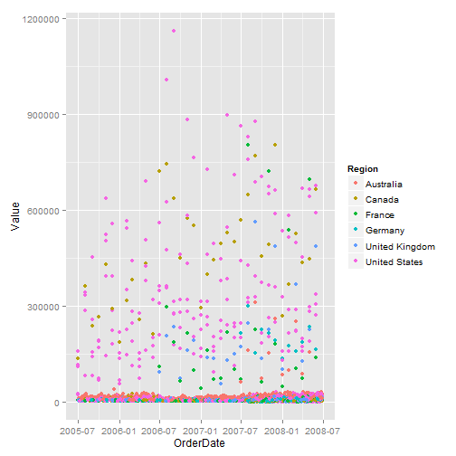
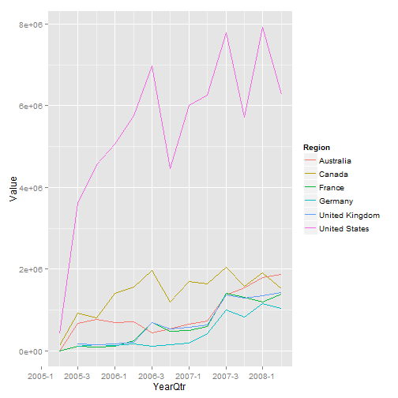
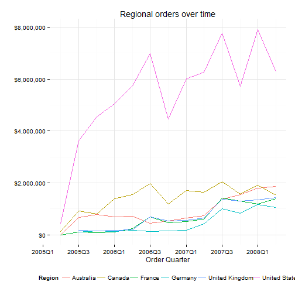
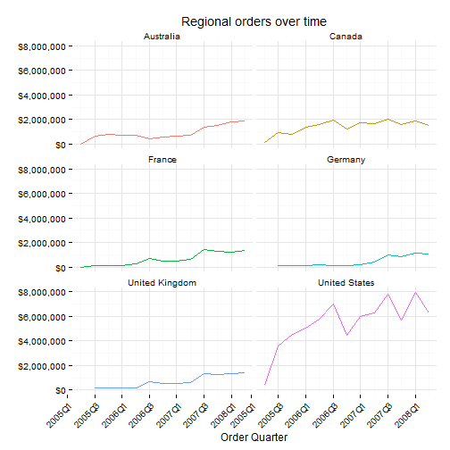

An Introduction to R
========================================================
author: Steph Locke (@stefflocke)
date: Feb 26th
navigation: section
font-family: 'Trebuchet'

About R
====================================
type: section

What's R?
========================================================

- R is a language 
- Originally created to do stats and produce graphics
- It's a whole extendable environment
- One of the largest growing languages out there


Why R?
========================================================

- It's open source - try/use it for free
- Integrates with most data sources
- Can work inside other languages
- Customisable/extendable to your circumstances
- Really, really fast
- Some super snazzy functionality

Why not R?
========================================================

- Written by stats bods so quite unique
- Stats emphasis can make it difficult to read documentation
- Myriad extensions can make it tough to know what to use
- It can be a bugger to google for

How to get started quickly
========================================================

- Install R [r-project.org](http://www.r-project.org/)
- Install Rstudio [Rstudio.com](http://www.rstudio.com) <- Best IDE ever
- You're done

Using R for analysis
====================================
type: section

Connecting to SQL Server
========================================================

```r
# Connection courtesy of Redgate - http://www.sqlservercentral.com/articles/Adventureworks/99291/

# Activate the ODBC package for use
library("RODBC")

# Build a connection to the DB for reuse
azure <- odbcDriverConnect("Driver={SQL Server Native Client 11.0};Server=mhknbn2kdz.database.windows.net;\nDatabase=AdventureWorks2012;Uid=sqlfamily;Pwd=sqlf@m1ly;")

# Store simple SELECT statement results
person <- sqlQuery(azure, "SELECT TOP 10 * FROM [Person].[Person]")

# That's really it! 
```


Get some more typical data
========================================================

```r
# SQL statement used by some SSRS reports
sales <- sqlQuery(azure, "
SELECT 
soh.OrderDate,
t.Name as Territory,
cr.countryregioncode as Code,
cr.Name as Region,
sum(TotalDue) as Value,
count(*) as Volume
FROM [Sales].[SalesOrderHeader] soh
INNER JOIN [Sales].[SalesTerritory] t 
          on t.territoryid=soh.territoryid
INNER JOIN [Person].[CountryRegion] cr 
          on cr.countryregioncode=t.countryregioncode
WHERE  soh.OrderDate < '2008-07-01'
GROUP BY soh.OrderDate,
t.Name ,
cr.Name,
cr.countryregioncode")
```


Make a quick chart
========================================================


```r
library("ggplot2")

#using the most basic method
qplot(OrderDate, Value, colour=Region, data=sales)

# urch - but seen worse
```

****
 

Make a meangingful chart - p1
========================================================


```r
library("data.table")
library("zoo")
library("scales")

# summarise data
sales.sum <- data.table(sales)[, 
    list(Value = sum(Value), Volume = sum(Volume)), 
    by = list(YearQtr = as.yearqtr(OrderDate), 
        Region, Code)]
```

****


Make a meangingful chart - p2
========================================================

```r
ggplot(data = sales.sum, aes(x = YearQtr, 
    y = Value, group = Region, 
    colour = Region)) + geom_line() + 
    scale_x_yearqtr() 
```

****
 


Make a meangingful chart - p3
========================================================


```r
last_plot() + theme_minimal() + 
theme( legend.position = "bottom" ) + 
labs(x = "Order Quarter", y = "", 
   title = "Regional orders over time") + 
scale_y_continuous( labels = dollar ) + 
scale_x_yearqtr( format = "%YQ%q" ) 

```

****
 


Make a meangingful chart - p4
========================================================
left: 40%

```r
last_plot() + facet_wrap( ~Region, 
    ncol = 2) + 
theme(legend.position = "none", 
  axis.text.x = element_text(angle = 45, 
    hjust = 1)) 
```

****
 


Using R for reports
====================================
type: section

Output to database
========================================================
Insert or update

```r
sqlSave(azure, sales.sum, salessumary)

```


Output to CSV
========================================================
Can do xlsx but I prefer keeping things in CSV

```r
write.csv(sales, "sales.csv")
```


Output to PDF
========================================================
- This uses MikTeX (or LaTeX which is the platform independent name)
- Create an .Rnw file
- Include R code chunks
- Run knit2pdf command


```r
knit2pdf(salesanalysis.Rnw)
```


Output to HTML (general method)
========================================================
- This uses markdown
- Create an .Rmd or .Rpres file
- Include R code chunks
- Run knit2html command
- Example = Supporting HTML file


```r
knit2html(salesanalysis.Rmd)
```


Output to presentation
========================================================
- This uses markdown
- Create an .Rpres file
- Include R code chunks
- Use GUI to publish to Rpubs or save project to dropbox/github etc
- Example = this presentation

Interactive reports
========================================================
- This uses a package called shiny
- Allows local running of interactive reports
- Very easy to code (as it only uses R)
- Shiny Server available for hosting of reports
- Authentication systems available
- [Examples](http://www.rstudio.com/shiny/showcase/)

Extra bits
====================================
type: section

Recommended packages - analysis
========================================================
- RODBC <- for a single layer of access to most databases
- data.table <- my go-to package for all data manipulation
  * [data.table homepage](http://datatable.r-forge.r-project.org/)
- zoo <- adds some excellent date/time functionality
- ggplot2 <- my go-to charting package
  * [ggplot2 homepage](http://ggplot2.org/)
- optiRum <- I made this, adds stuff primarily for finance folks

Recommended packages - reporting/documentation
========================================================
- xtable <- for tables in documentation
- knitr <- for documentation
- shiny <- for interactive reports

Recommended packages - package development
========================================================
- testthat <- for unit testing
- devtools <- for general package dev

How to get up and running fully
========================================================
Install and learn
- R
- Rstudio
- Git
- LaTeX

I actually prefer running R stuff on Linux

Thanks and Q&A / ad-hoc demo
====================================
type: section
