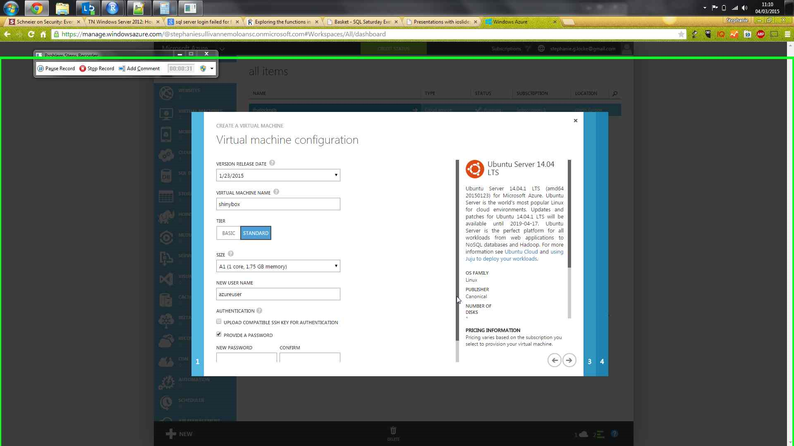
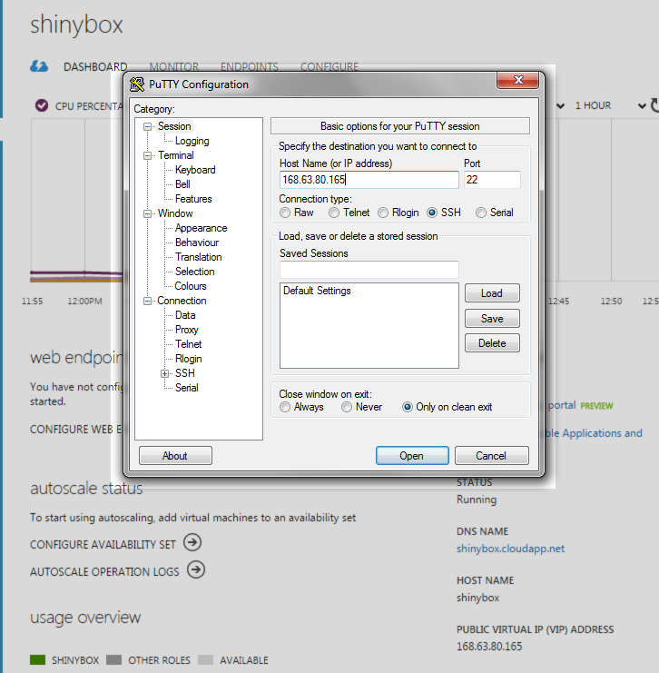
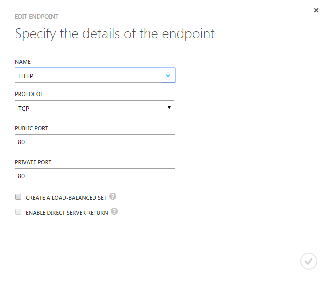
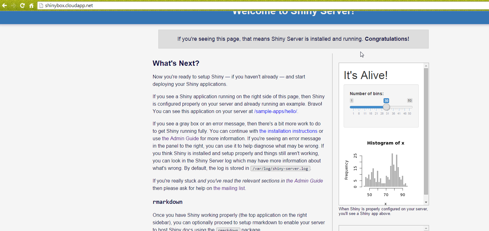

## Server creation
Azure portal, using gallery creation for VM

## Configuring the VM
1. Get [PuTTY](http://the.earth.li/~sgtatham/putty/latest/x86/putty.exe)
2. Connect to your VM via the public IP

3. Use the login details in the creation wizard. *The password won't look like you're typing*
3. Run `sudo apt-get update` to get the package repository metadata
4. Run `sudo apt-get install r-base` to get R. *Will have lots of extra associated packages - select Y when prompted*
5. Follow the [installation instructions](http://rstudio.github.io/shiny-server/latest/)
    + Run `sudo su - -c "R -e \"install.packages('shiny', repos='http://cran.rstudio.com/')\""` to install shiny in R
    + Run `sudo apt-get install gdebi-core` to enable processing of shiny-server installation package
    + And so on through the remaining two major steps in instructions

## Configuring port (away from 3838) and allowing on Azure
1. Change shiny-server to run on port 80 by amending port in conf file `sudo nano /etc/shiny-server/shiny-server.conf`
2. Restart shiny-server to apply port change `sudo restart shiny-server`
3. Add port 80 to Azure endpoints for the VM

