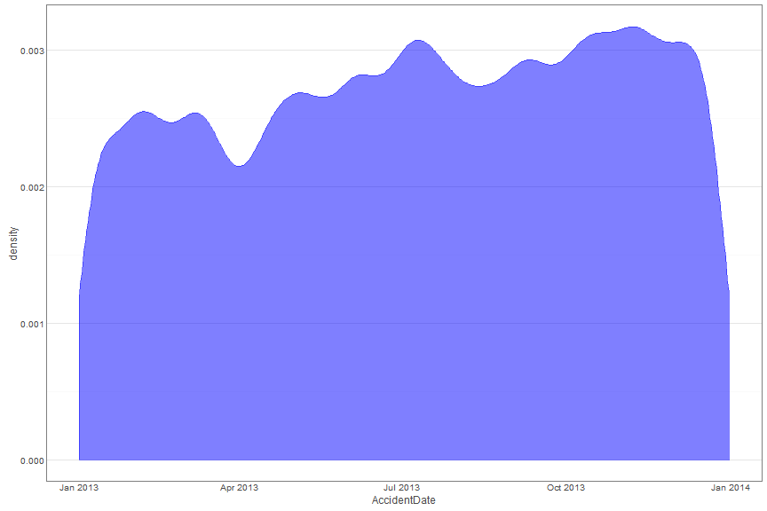
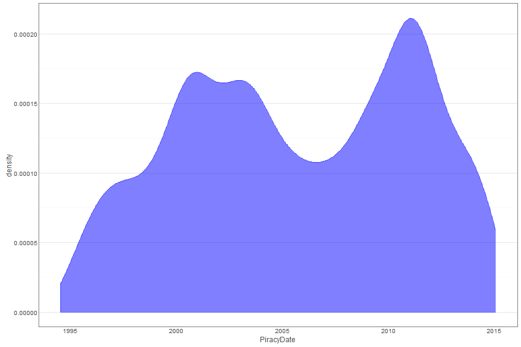

# Car accident data
TableD1 sdfhsdldkjf

| Accident_Index| Location_Easting_OSGR| Location_Northing_OSGR| Longitude| Latitude|
|--------------:|---------------------:|----------------------:|---------:|--------:|
|          82610|                 83823|                  86015|    131686|   130388|

 

ChartD1

# Piracy data
TableD2

| Date| Ship Name| Ship Type| IMO No.| Area|
|----:|---------:|---------:|-------:|----:|
| 4069|      5386|       124|    4598|    7|

ChartD2

 
