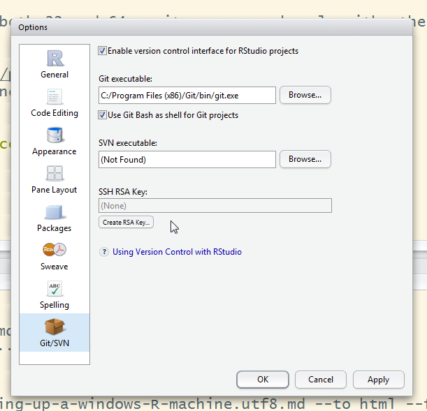

## R
 * Download latest base R exe file from [cran.rstudio.com](http://cran.rstudio.com/)
 * Also download Rtools latest exe
 * Install R then Rtools - if 64bit, install both 32 and 64 as it saves you hassle with other drivers

## Rstudio
 * Go to [rstudio.com](http://www.rstudio.com/products/rstudio/download/)
 * Select correct install file for your PC, and install
 
## Git
 * Download latest git version from [git-scm.com](http://git-scm.com/download/win)
 * Install

## Configuration
 * Open Rstudio
 * Go to Tools> global options and set rstudio to point at the location of your git.exe file

 * Setup your details in git by going to git > shell in Rstudio or opening up command-prompt
     + Run `git config --global user.name="Your name"`
     + Run `git config --global user.email="email@addre.ss"`
 * Use Packages > Install to install devtools and installr