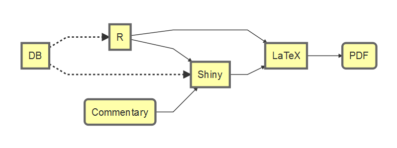

## Who am I?
> I'm Steph Locke

- BI & R fan
- Principal Consultant at Mango
- Speaker and user group leader
- [\@SteffLocke](https://twitter.com/stefflocke)
- [github.com/stephlocke](https://github.com/stephlocke)

## What's a board pack?

- A collection of key metrics from around the business
- An account of performance from department heads
- A high visibility piece of MI
- A very time consuming document to produce!
- A very expensive document to produce!

## What's a board pack like?

- A research update
- Other pieces of MI
- Business Plans
- Annual Returns
- Other documents with multiple diagrams and associated text

## How is it typically done?

- Lots of people across the company beavering away in spreadsheets
- Outputting to Word (hopefully not Excel)
- Lots of stuff gets emailed
- Lots of stuff gets typed, then emailed
- Someone painstakingly consolidates all the sheets / docs into a PDF
- Lots of people criticise / feedback
- Repeat all of above, eventually just publish anyway

## What's would we like to achieve?

- Reduction in sending work back upstream
- Reduction in executive time to produce
- Standardisation of look and feel
- Reduction in spreadsheets

## Translating aim to reality
```{r, echo=FALSE, eval=FALSE}
library(DiagrammeR)
mermaid("
        graph LR
        R[R] --> L[LaTeX]
        R --> S[Shiny]
        S --> L
        D[DB] -.-> R
        D -.-> S
        C(Commentary) --> S
        L --> P(PDF)
        ")
```



## Demo

## What's next
- Save for later functionality
- Upload PDFs to be stitched in
- Dynamic Rmd generation (from db)

## Get the code
```{r, eval=FALSE}
if (!require(git2r)){
  install.packages("git2r")
} 
git2r::clone("https://github.com/stephlocke/Rtraining")
```
